## Introduction

Create tile positions in hexagon/triangle/parallelogram geometry in hexagon grid. 

- Author: Rex
- Help method of board

## Usage

[Sample code](https://github.com/rexrainbow/phaser3-rex-notes/tree/master/examples/board-hexagonmap)

### Install plugin

#### Load minify file

- Load plugin (minify file) in preload stage
    ```javascript
    scene.load.scenePlugin('rexboardplugin', 'https://raw.githubusercontent.com/rexrainbow/phaser3-rex-notes/master/dist/rexboardplugin.min.js', 'rexBoard', 'rexBoard');
    ```
- Create tile positions
    ```javascript
    var tileXYArray = scene.rexBoard.add.hexagonMap.hexagon(board, radius);
    var tileXYArray = scene.rexBoard.add.hexagonMap.parallelogram(board, type, width, height);
    var tileXYArray = scene.rexBoard.add.hexagonMap.triangle(board, type, height);
    ```

#### Import plugin

- Install rex plugins from npm
    ```
    npm i phaser3-rex-plugins
    ```
- Install plugin in [configuration of game](game.md#configuration)
    ```javascript
    import BoardPlugin from 'phaser3-rex-plugins/plugins/board-plugin.js';
    var config = {
        // ...
        plugins: {
            scene: [{
                key: 'rexBoard',
                plugin: BoardPlugin,
                mapping: 'rexBoard'
            },
            // ...
            ]
        }
        // ...
    };
    var game = new Phaser.Game(config);
    ```
- Create tile positions
    ```javascript
    var tileXYArray = scene.rexBoard.add.hexagonMap.hexagon(board, radius);
    var tileXYArray = scene.rexBoard.add.hexagonMap.parallelogram(board, type, width, height);
    var tileXYArray = scene.rexBoard.add.hexagonMap.triangle(board, type, height);
    ```

#### Import class

- Install rex plugins from npm
    ```
    npm i phaser3-rex-plugins
    ```
- Import class
    ```javascript
    import { HexagonMap } from 'phaser3-rex-plugins/plugins/board-components.js';
    ```
- Create tile positions
    ```javascript
    var tileXYArray = HexagonMap.hexagon(board, radius);
    var tileXYArray = HexagonMap.parallelogram(board, type, width, height);
    var tileXYArray = HexagonMap.triangle(board, type, height);
    ```

#### Create tile positions

##### Hexagon

```javascript
var tileXYArray = scene.rexBoard.hexagonMap.hexagon(board, radius);
// var out = scene.rexBoard.hexagonMap.hexagon(board, radius, out);
```

- `tileXYArray` : An array of tile position `{x, y}`.
- `board` : [Board object](board.md).
- `radius` : Radius in tile count.

| staggeraxis | y | x |
| ---- | ---- | ---- |
||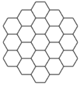|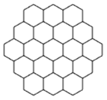|

##### Parallelogram

```javascript
var tileXYArray = scene.rexBoard.hexagonMap.parallelogram(board, type, width, height);
// var out = scene.rexBoard.hexagonMap.parallelogram(board, type, width, height, out);
```

- `tileXYArray` : An array of tile position `{x, y}`.
- `board` : [Board object](board.md).
- `width`, `height` : Size of parallelogram

| type\staggeraxis | y                                                            | x                                                            |
| ---------------- | ------------------------------------------------------------ | ------------------------------------------------------------ |
| 0                | 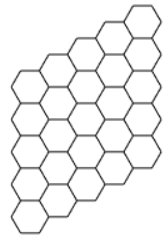 | 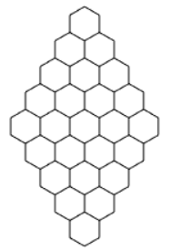 |
| 1                | 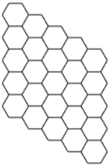 | 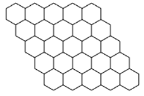 |
| 2                | 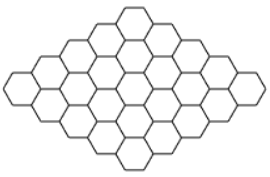 | 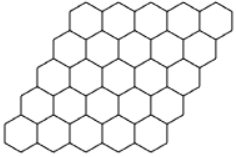 |

##### Triangle

```javascript
var tileXYArray = scene.rexBoard.hexagonMap.triangle(board, type, height);
// var out = scene.rexBoard.hexagonMap.triangle(board, type, height, out);
```

- `tileXYArray` : An array of tile position `{x, y}`.
- `board` : [Board object](board.md).
- `height` : Size of Triangle

| type\staggeraxis | y                                                       | x                                                       |
| ---------------- | ------------------------------------------------------- | ------------------------------------------------------- |
| 0                |  | 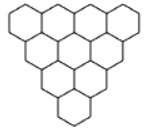 |
| 1                | 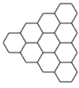 | 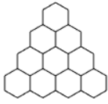 |

#### Retrieve tile positions

1. Offset all of tile positions to `(0, 0)`, and set board size to fit these tile positions.
    ```javascript
    var tileXYArray = board.fit(tileXYArray);
    ```
2. Retrieve tile positions
    ```javascript
    var tileXY;
    for(var i = 0, cnt = tileXYArray.length; i < cnt; i++) {
        tileXY = tileXYArray[i];
        // ...
    }
    ```